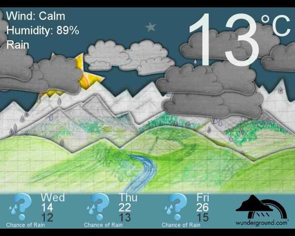

# A hand-drawn weather display

## Configuration

### API Key (key)

The weather display uses the [Wunderground weather API](http://www.wunderground.com/weather/api/). Create a free account
there and copy your API key into this field.

### Location (location)

Type in a location and you'll get a dropdown of all possible matches. Select the location you want to display.

### Timezone (timezone)

Timezone setting used to display the day/night cycle.

## Transitioning to other packages

This package is obsolete now as Wunderground shut down their API and this package didn't really integrate into any
other packages. The Schedule Player package offers a better option to show a weather forecast and you can freely
mix a forecast with other content. Have a look at:

https://info-beamer.com/pkg/4765
